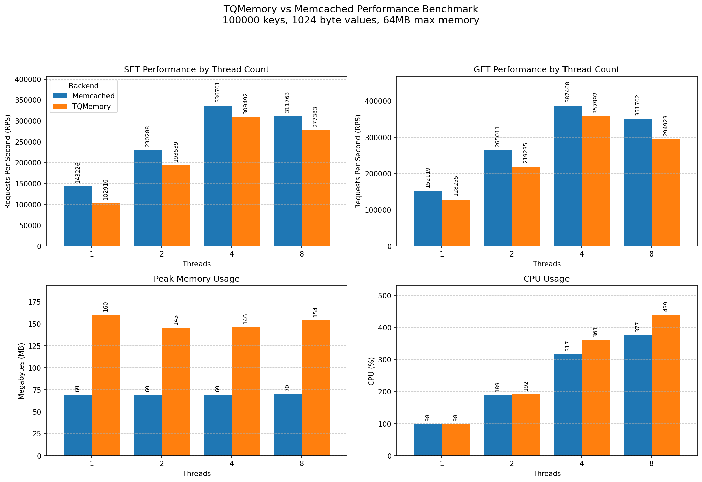

# TQMemory

TQMemory is a high-performance, non-persistent memory cache server. It provides a
Memcached-compatible interface, making it ideal as a drop-in replacement for
`memcached`. Especially for Go developers, it can be used as a Go package for
in-process caching.

Blog post: https://www.tqdev.com/2026-tqmemory-memcached-alternative

## Features

- **Memory Cache**: Ideal as a drop-in replacement for `memcached`
- **Competitive Performance**: Matches or exceeds Memcached performance
- **Memcached Compatible**: Supports all Memcached commands, text and binary
- **Same CLI Flags**: Uses identical command-line options as memcached
- **Go package**: Can be used as a Go package for in-process caching

## Requirements

- Go 1.21 or later

## Installation

```bash
go install github.com/mevdschee/tqmemory/cmd/tqmemory@latest
```

Or build from source:

```bash
git clone https://github.com/mevdschee/tqmemory.git
cd tqmemory
go build -o tqmemory ./cmd/tqmemory
```

## Usage

```bash
tqmemory [options]
```

### Command-Line Flags

Uses the same flags as memcached (with long name alternatives):

| Short  | Long           | Default      | Description                              |
| ------ | -------------- | ------------ | ---------------------------------------- |
| `-p`   | `-port`        | `11211`      | TCP port to listen on                    |
| `-s`   | `-socket`      |              | Unix socket path (overrides -p and -l)   |
| `-l`   | `-listen`      | (all)        | Interface to listen on                   |
| `-m`   | `-memory`      | `64`         | Max memory in megabytes                  |
| `-c`   | `-connections` | `1024`       | Max simultaneous connections             |
| `-t`   | `-threads`     | `4`          | Number of threads                        |
|        | `-config`      |              | Path to [config file](cmd/tqmemory/tqmemory.conf) |

**Fixed limits:** Max key size is 250 bytes. Max value size is 1MB.

### Examples

```bash
# Start with defaults (same as memcached defaults)
tqmemory

# Listen on port 11212 with 128MB memory and 8 threads
tqmemory -p 11212 -m 128 -t 8

# Same using long names
tqmemory -port 11212 -memory 128 -threads 8

# Listen only on localhost
tqmemory -l 127.0.0.1

# Use a config file
tqmemory -config /etc/tqmemory.conf
```

## Performance

**TQMemory vs Memcached** (Unix sockets, 10 clients, 10KB values)

| Threads | TQMemory (SET/GET) | Memcached (SET/GET) | SET Δ    | GET Δ |
|---------|--------------------|---------------------|----------|-------|
| 4       | **225K** / 261K    | 149K / 281K         | **+51%** | -7%   |
| 8       | **266K** / 251K    | 152K / 307K         | **+75%** | -18%  |

**TQMemory as Go package** (in-process, 10 clients, 10KB values)

| Threads | TQMemory (SET/GET)  |
|---------|---------------------|
| 4       | **403K** / **2.6M** |
| 8       | **611K** / **3.9M** |

**Highlights:**
- SET operations over sockets are **1.5-1.8x faster** than Memcached at 4-8 threads
- GET is slightly slower over sockets, but **9-13x faster** with direct package calls

### Benchmark Chart



Benchmarks were run on a local development environment (Linux, Unix sockets).

See [OPTIMIZATIONS.md](OPTIMIZATIONS.md) for details on performance tuning.

## Testing

```bash
go test ./pkg/tqmemory/...
```

## Architecture

TQMemory uses a sharded, worker-based architecture optimized for high-throughput:

- **Sharded Cache**: Keys are distributed across workers via FNV-1a hash
- **Lock-Free Workers**: All operations go through channels to a single worker goroutine per shard
- **No Lock Contention**: Each worker owns its shard exclusively, eliminating locks
- **Memory Management**: Per-worker memory limits with LRU eviction

See [PROJECT_BRIEF.md](PROJECT_BRIEF.md) for detailed architecture.
